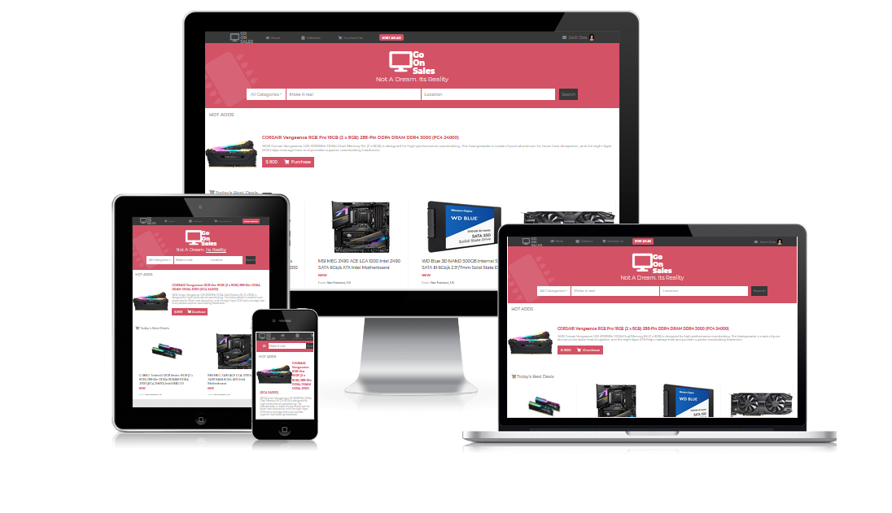

# Capstone-Project
For this project, I build an online shop using HTML & CSS. the project is completely repsonsive, mobile view is visible under 768px, tablet view is visible under 992px and laptop/desktop is visible above 992px, there are 2 pages, the first one being the home page and the second being the search result page Which will open after clicking the search button. This HTML & CSS Capstone Project is based on an online shop for electronics. Following the desing of ZATTIX (by Mohammed Awad).

This web page is developed by HTML5, SCSSS and Bootstrap.

## Built With

- HTML5,
- CSS,
- SCSS
- Bootstrap
- Stylelint and stickler for linting purpose,
- html-validator-cli for validate HTML

## Live Demo

https://shaqri.github.io/Capstone-Go-on-sales/

## Video Link

https://www.loom.com/share/bdd98e94db464111b21d378a6d29deb2

## Getting Started

**Install on Your Own Machine.**
**You can skip the linter and HTML validetors setup if you don't want to validate the code**

Setup your machine setup

### Prerequisites

  > All the prerequisites are optional

- Git
- HTML validator
- CSS Linters

### Setup

- Follow the link below to install git.
  > [download git](https://git-scm.com/downloads)
- Follow the link below to setup HTML validator.
  > [Setup HTML validator](https://github.com/microverseinc/linters-config/tree/master/html_validator)
- Follow the link below to setup linter.
  > [Setup CSS Linter to check code errors](https://github.com/microverseinc/linters-config/tree/master/css#troubleshooting)
- Clone the repository
  > to clone the repository simply run the code below on your computer termial
  `git clone https://github.com/abredi/NYTimes.git`

### Install

*Optional*
Go to the project directory on your terminal and run `npm install` to install the HTML validator and CSS linters

### Usage

Go to the project directory and run open the `index.html` file on your browser.

## Author

👤 **Victor Manuel Gonzalez Buitrago**

- Github: [@Shaqri](https://github.com/Shaqri)
- Twitter: [@victorgonbu](https://twitter.com/victorgonbu)
- Linkedin: [linkedin](https://www.linkedin.com/in/victor-manuel-gonzalez-buitrago-8704731a5/)

## 🤝 Contributing

Contributions, issues and feature requests are welcome!

Feel free to check the [issues page](issues/).

## Show your support

Give a ⭐️ if you like this project!

## Acknowledgments

- [Thanks Microverse][https://github.com/microverseinc]

## 📝 License

This project is [MIT](LICENSE) licensed.
